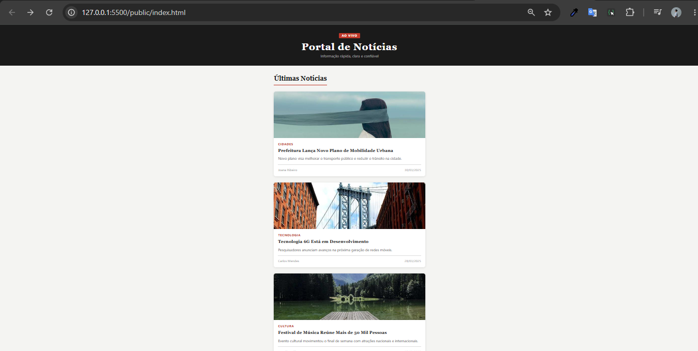
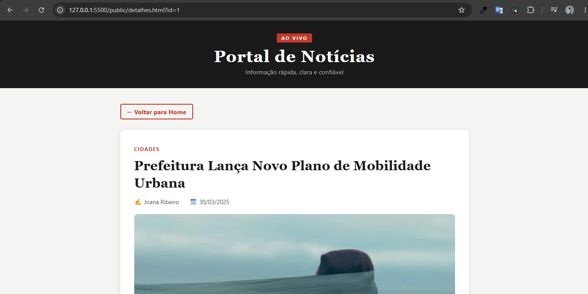

[](https://classroom.github.com/a/jBAz0Mjg)
# Trabalho Prático - Semana 11

Nesta atividade, vamos evoluir o projeto em que estamos trabalhando nesse semestre, acrescentando a página de detalhes.

Imagine que a página principal (home-page) mostre um visão dos vários itens que existem no seu site. Ao clicar em um item, você é direcionado pra a página de detalhes. A página de detalhe vai mostrar todas as informações sobre o item do seu projeto, seja esse item uma notícia, filme, receita, lugar turístico ou evento.

## Informações Gerais

- Nome: Arthur Gabriel de Oliveira Fonseca Santos
- Matricula: 924860
- O projeto é um Portal de Notícias que exibe, na página principal, cards com as principais notícias do momento. Ao clicar em uma notícia, o usuário é direcionado para a página de detalhes, onde pode ler o conteúdo completo, ver o autor e a data de publicação. Todos os dados são carregados dinamicamente via JavaScript a partir de uma estrutura JSON.

## Prints do trabalho

<<  COLOQUE A IMAGEM - HOME-PAGE - AQUI >>


<<  COLOQUE A IMAGEM - TELA DE DETALHES - AQUI >>


## Dados em JSON
Inclua aqui a estrutura de dados definida por você para o projeto com pelo menos dois exemplo de dados.

```json
[
  {
    "id": 1,
    "titulo": "Prefeitura Lança Novo Plano de Mobilidade Urbana",
    "descricao": "Novo plano visa melhorar o transporte público e reduzir o trânsito na cidade.",
    "conteudo": "A Prefeitura apresentou nesta segunda-feira um novo plano de mobilidade urbana que inclui a criação de corredores exclusivos de ônibus, ciclovias e a requalificação de vias principais. O projeto será implementado ao longo dos próximos dois anos.",
    "categoria": "Cidades",
    "autor": "Joana Ribeiro",
    "data": "2025-03-30",
    "imagem": "img/mobilidade.jpg"
  },
  {
    "id": 2,
    "titulo": "Tecnologia 6G Está em Desenvolvimento",
    "descricao": "Pesquisadores anunciam avanços na próxima geração de redes móveis.",
    "conteudo": "Universidades e empresas de telecomunicação já estão testando tecnologias que poderão compor a infraestrutura do 6G. A expectativa é que a nova geração seja 100 vezes mais rápida que o 5G e amplie a integração entre dispositivos inteligentes.",
    "categoria": "Tecnologia",
    "autor": "Carlos Mendes",
    "data": "2025-03-28",
    "imagem": "img/tecnologia_6g.jpg"
  }
]
```